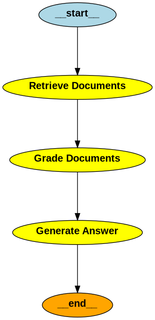

# Assistente de Legislação Condominial Brasileira Baseado em RAG

**Sistema de Agentes com RAG para Consulta de Dúvidas Sobre Condomínios**

[](https://python.org)
[](https://langchain.com)
[](https://opensource.org/licenses/MIT)
[](https://streamlit.io)

## Features

### Consultation Mode
- Answer questions about Brazilian condominium law based on the Civil Code
- Upload internal condominium documents (convenção, regimento interno) for contextualized answers
- Automatic source identification showing only relevant legal articles
- Proactive document generation suggestions based on user questions
- Multi-format document export (TXT, DOCX, PDF)

### Legality Analysis Mode
- Upload condominium convention or bylaws for legal compliance analysis
- Automatic clause extraction and classification by topic
- Detection of potentially illegal clauses with confidence levels
- Civil Code article references for each flagged clause
- Recommendations for corrections
- JSON report export

### Document Generation
Automatically generate formal condominium documents:
- Noise notifications (Notificação de Barulho)
- Delinquency notices (Notificação de Inadimplência)
- Formal warnings (Advertência)
- Assembly convocations (Convocação de Assembleia)
- Assembly minutes (Ata de Assembleia)
- General announcements (Comunicado Geral)

## Installation

### 1. Clone the Repository
```bash
git clone https://github.com/rembrandtcosta/ragagent
cd ragagent
```

### 2. Create a Virtual Environment
```bash
python -m venv venv
source venv/bin/activate  # On Windows use `venv\Scripts\activate`
```

### 3. Install Dependencies
```bash
pip install -r requirements.txt
```

### 4. Set Up Environment Variables
```bash
export GOOGLE_API_KEY='your_google_api_key'
```

### 5. Index Documents
```bash
python ingest/ingest.py
```

## Usage
```bash
streamlit run app.py
```
Open your browser and navigate to `http://localhost:8501`.

## Running Tests
```bash
pytest tests/ -v
```

## Stack
- Python 3.10+
- LangChain / LangGraph
- Streamlit
- ChromaDB
- Gemini API
- Cross-encoder reranking (ms-marco-MiniLM-L-6-v2)

## Architecture


## Project Structure
```
ragagent/
├── app.py                 # Streamlit application
├── rag_workflow.py        # Main RAG workflow and analysis graphs
├── config.py              # Configuration constants
├── chains/                # LLM chains
│   ├── generate_answer.py
│   ├── clause_extractor.py
│   ├── illegality_detector.py
│   ├── document_suggester.py
│   ├── document_writer.py
│   ├── document_fields.py
│   ├── source_identifier.py
│   └── internal_docs.py
├── utils/
│   └── document_formatter.py  # Multi-format document export
├── tests/                 # Unit tests
├── ingest/                # Document ingestion scripts
└── db/                    # ChromaDB vector store
```

[Presentation Slides](https://docs.google.com/presentation/d/1PK9flkIM0cSrO4_OdMueWE8zr5tly3LXo8hn993i0K8/edit?usp=sharing)

